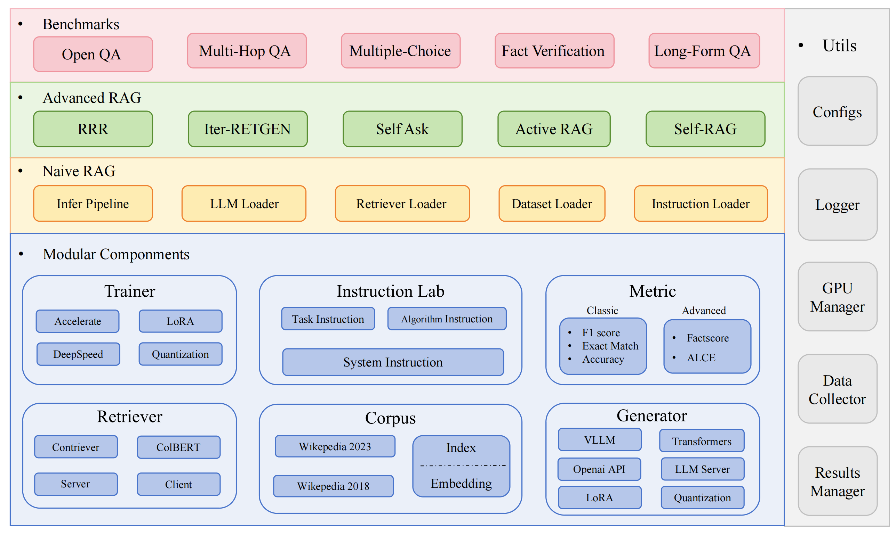








Greetings! I am Yunze Song, currently pursuing my graduate studies at the National University of Singapore. My research is centered on advancing the field of artificial intelligence, with a particular emphasis on the fair evaluation of large models and the safer development of generative AI systems. Additionally, I am exploring the integration of large language models into robotics, aiming to enhance the capabilities of AI-driven systems in practical applications.

I have had the opportunity to conduct research at esteemed institutions such as Peking University and Westlake University, where my work focused on LLM Evaluation and Retrieval-Augmented Generation. I aspire to achieve meaningful outcomes through research and develop the capacity to bring happiness and positive impact to others.

# 😎 News

- *2024.02*: I joined <a href='https://se.pku.edu.cn/kcl/'>The Knowledge Computing Lab at Peking University</a> as a research intern, supervised by <a href='https://qianlanwyd.github.io/'>Dr. Yidong Wang</a> and <a href='https://se.pku.edu.cn/kcg/weiye/'>Prof. Wei Ye</a>.
- *2023.09*: I completed a research internship at <a href='https://nlp.westlake.edu.cn/index.htm'>Text Intelligence Lab of Westlake University</a>, supervised by <a href='https://yanglinyi.github.io/'>Dr. Linyi Yang</a> and <a href='https://frcchang.github.io/'>Prof. Yue Zhang</a>.
- *2023.07*: I received my first-class honors bachelor's degree with top-ranking distinction, under the supervision of <a href='https://scholar.xjtlu.edu.cn/en/persons/liminyu'>Prof. Limin Yu</a>.

# 📝 Publications

  

    

      
EMNLP 2024 Demo

      
    

  

  

    
**RAGLAB: A Modular and Research-Oriented Unified Framework for Retrieval-Augmented Generation [Paper](https://arxiv.org/pdf/2408.11381) [Code](https://github.com/fate-ubw/RAGLAB) **

Xuanwang Zhang *,**Yunze Song \***, Yidong Wang, Shuyun Tang, Xinfeng Li, Zhengran Zeng, Zhen Wu, Wei Ye, Wenyuan Xu, Yue Zhang, Xinyu Dai, Shikun Zhang, Qingsong Wen

To address hallucinations and difficulties in updating real-time knowledge, Retrieval Augmented Generation (RAG) equips Large Language Models with external knowledge. However, two major obstacles hinder RAG's progress. First, there is a growing lack of thorough and fair comparisons between emerging RAG algorithms. Second, open-source tools like LlamaIndex and LangChain use high-level abstractions, reducing transparency and limiting innovation in algorithm development and evaluation. To bridge this gap, we introduce RAGLAB, a modular, research-focused open-source library. RAGLAB replicates six existing algorithms and offers a comprehensive ecosystem for exploring RAG techniques. Using RAGLAB, we fairly compare six RAG algorithms across ten benchmarks, enabling researchers to efficiently evaluate and develop new algorithms.

# 🎖 Honors and Awards

- *2019-2020*: University Academic Achievement Award (5,000 CNY)
- *2020-2021 & 2021-2022*: University Academic Excellence Award (10,000 CNY Per Year)
- *2020-2021 & 2021-2022*: University Outstanding Students Award

# 📖 Educations

- *2025.01 - 2026.07*, Master of Science in Robotics at <a href='https://nus.edu.sg/'>National University of Singapore</a>.
- *2019.09 - 2023.07*, Undergraduate student in the Department of Computer Science and Technology at <a href='https://www.xjtlu.edu.cn/zh'>Xi'an Jiaotong-Liverpool University</a> in China and <a href='https://www.liverpool.ac.uk/'> the University of Liverpool</a> in the UK.

# 💻 Internships

- *2023.11 - now*: Research Intern, Peking University
- *2023.09 - 2024.02*: NLP Engineer, FaceMind Co., Ltd. (An AI Startup)
- *2023.05 - 2023.09*: Research Intern, Westlake University
- *2022.06 - 2022.09*: Research Assistant, Xi'an Jiaotong-Liverpool University

# 📷 Photography
When am I ever gonna snag that Hasselblad 503cx?
